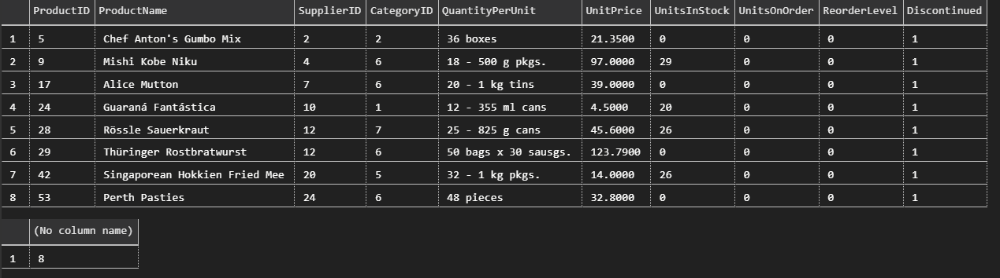

# Question 1


1. ```sql
    SELECT City FROM Employees;
    SELECT COUNT(EmployeeID) FROM Employees WHERE City = 'London';
    ```

    

    <br>

2. ```sql
    SELECT LastName, FirstName FROM Employees WHERE TitleOfCourtesy = 'Dr.'
    ```

    

    <br>

3. ```sql
    SELECT * FROM Products WHERE Discontinued = 1;
    SELECT COUNT(ProductName) FROM Products WHERE Discontinued = 1;
    ```

    

<br>

# Question 2


1. ```sql
    SELECT ProductName, ProductID FROM Products WHERE UnitPrice < 5;
    ```

    

2. ```sql
    SELECT * FROM Categories WHERE CategoryName LIKE 'B%' OR CategoryName LIKE 'S%';
    ```

    

3. ```sql
    SELECT COUNT(OrderID) FROM Orders WHERE EmployeeID = 5 OR EmployeeID = 7;
    ```
    
    

<br>

# Question 3


1. ```sql
    SELECT CONCAT(FirstName,' ', LastName) AS 'Employee Name' FROM Employees;
    ```

    

<br>    

# Question 4


1. ```sql
    SELECT DISTINCT Country FROM Customers WHERE Region IS NOT NULL;
    ```

    


    